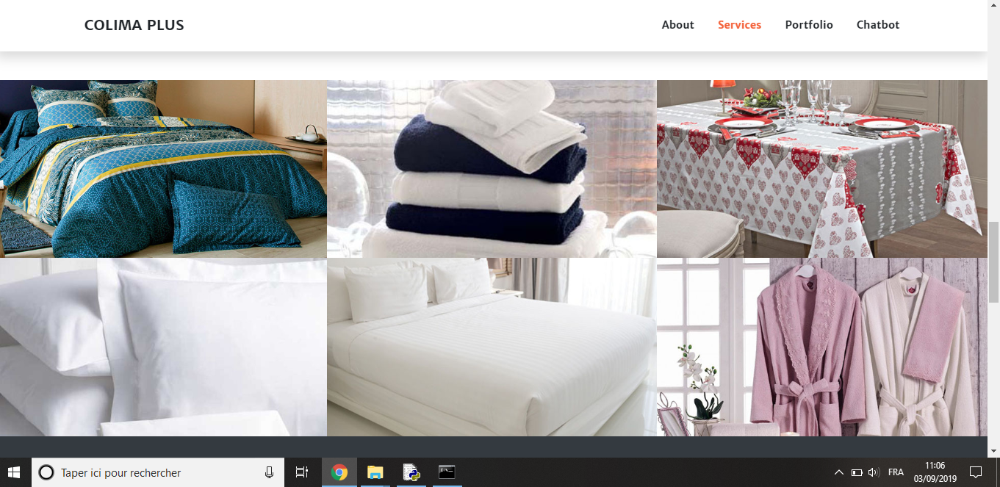
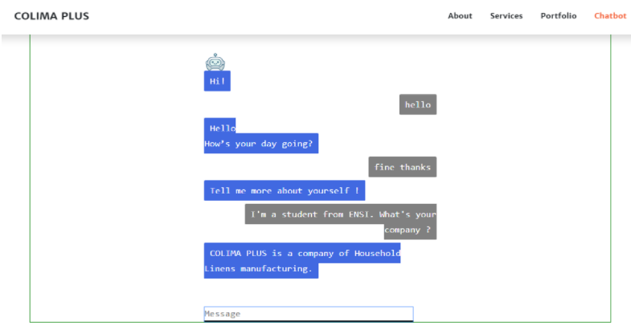
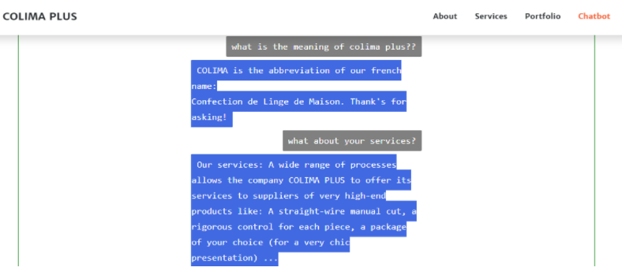

# Smart-Chatbot-For-Company-Clients

In this project, we designed and developed a web application containing a smart chatbot for the company "Colima PLUS", which specializes in manufacturing and selling household linens online.

**ColimaBot** is a Smart chatbot based on Natural Language Processing that facilitates the interaction between the company "Colima PLUS" and its customers.

📍 **Keywords:** Python, NLTK, Spacy, Bootstrap, Flask

📍 **Screenshots:**

📝 This image shows the web application of Colima Plus 

📝 This is the chatbot interface where customers request more information about the company and its services, and interact to submit a purchase request online.

📅 **Last Update On :** September 2019.

**No further updates are planned.**

📢 **Notes :**

For confidentiality obligations, we cannot share the entire source code. 

We are restricted to the general presentation and some screenshots.

✉️ **Contact** : 

email : ghassene.tanabene@gmail.com

linkedin : https://www.linkedin.com/in/ghassene-tanabene/
